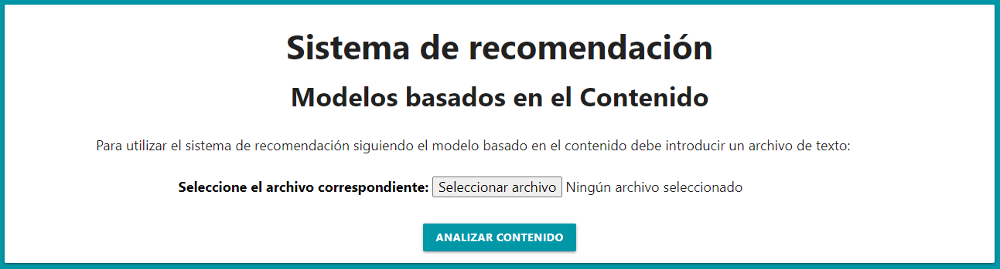

# Gestión del Conocimiento en las organizaciones
## Sistemas de recomendación. Modelos Basados en el Contenido
### Autor: Alberto Mendoza Rodríguez (alu0101217741@ull.edu.es)


<p align="center">
  <br>
  Acceda al sistema de recomendación: <a href="https://alu0101217741.github.io/Modelos_Basados_en_el_Contenido_GCO/">https://alu0101217741.github.io/Modelos_Basados_en_el_Contenido_GCO/</a>
  <br>
</p>

***

## 1. Introducción

Este repositorio incluye el código fuente que implementa un sistema de recomendación siguiendo el modelo basado en contenido. Gran parte de estos modelos se aplican al campo de la recomendación de documentos con información textual. De esta forma el contenido de los ítems se representa a través de documentos en los que se incluyen descripciones textuales de sus características básicas.

Para desarrollar el sistema de recomendación se han utilizado los lenguajes de programación **HTML**, **CSS** y  **JavaScript** de forma que el usuario puede introducir a través de una página web el fichero que se analizará empleando el sistema desarrollado, y así obtener los resultados en la pantalla de su navegador. Cabe destacar que para establecer el estilo de la página también se ha empleado el framework de CSS  [Materialize](https://materializecss.com/).

## 2. Estructura de directorios

El sistema de recomendación se encuentra dentro de **docs** que incluye los siguientes directorios y ficheros:

* **css**: Almacena la hoja de estilo **style.css** para definir la presentación para el documento escrito en HTML.
* **examples-documents**: Incluye diferentes ejemplos de documentos con los que se puede comprobar el correcto funcionamiento del programa.
* **src**: Almacena los siguientes ficheros con código JavaScript:

  * **form.js**: Permite gestionar el formulario donde el usuario debe introducir el documento y hace posible mostrar los resultados.

  * **recommender.js**: Se define la clase **Recommender** que implementa el sistema de recomendación siguiendo el modelo basados en el contenido, de forma que calcula la frecuencia de las palabras en cada uno de los documentos (valores TF), los valores IDF de las palabras de cada documento, el valor TF - IDF para cada una de las palabras y la similaridad coseno entre cada par de documentos.

## 3. Descripción del código desarrollado
A continuación, se describe el contenido de cada uno de los ficheros que forman el sistema de recomendación.

### 3.1. index.html
En primer lugar, el fichero **index.html** contiene el formulario donde el usuario puede subir el archivo de texto que desea analizar. Como ya se ha comentado anteriormente para aportar una adecuada presentación se ha empleado Materialize y la hoja de estilo style.css.

### 3.2. form.js

Permite obtener el fichero que ha introducido el usuario a través del formulario, lo que hace posible almacenar su contenido en una variable y procesarlo para convertirlo en una matriz que facilite su análisis en la clase Recommender. Para realizar esta interacción se ha empleado el evento `click` sobre el botón del formulario que tiene el id `read_button`.

```js
document.getElementById('read_button').addEventListener('click', function() {
```
De esta forma cuando se pulse el botón se comprueba que el usuario ha introducido un fichero, tras ello se procesa, para lo que se toma el nombre del archivo y se crea un objeto de la clase `FileReader()`. 

```js
   if(document.getElementById("file-input").files.length == 0) {
        alert('ERROR: No ha introducido ningún fichero.');
		return;
	}

    let file = document.getElementById("file-input").files[0];

    let reader = new FileReader();
```

Luego se lee como un fichero de texto mediante `reader.readAsText(file);` y se emplean dos nuevos eventos sobre el objeto `reader`. El primero es `load` que se ejecuta cuando  ha finalizado correctamente la lectura del fichero. El otro es `error` que se ejecuta si ha ocurrido algún error en la lectura del fichero para informar al usuario.

```js
reader.addEventListener('load', function(e) {
```

```js
reader.addEventListener('error', function() {
```

Dentro del evento `load` se obtienen los datos leídos del fichero y se tranforman para crear una matriz `documents` donde cada fila representa un documento y contiene las palabras que lo forman.

Tras ello, se crea el objeto `recommender` de la clase `Recommender` pasándole la matriz que se ha creado a partir del archivo de texto.

```js
const recommender = new Recommender(documents);
 ```
 
 Por último, se llaman a los métodos de la clase `Recommender` para obtener los resultados y se muestran en la página web empleando las funciones `show_result`, `show_table_similarity` y `show_table` que incorporan código HTML.
 
 ```js
  document.getElementById("result").innerHTML = show_result(recommender.get_documents(), recommender.get_tf(), recommender.get_idf(), recommender.get_tf_idf(), recommender.get_cosine_similarity());
  ```
 
  ### 3.3. recommender.js
  
 Este fichero incluye la clase `Recommender` que implementa un recomendador siguiendo el modelo basado en el contenido.
 
  ### Constructor
  El constructor de la clase es el que se muestra a continuación:
  
  ```js
  constructor(documents) {
        this.documents = this.duplicate_words(documents);
        this.tf = this.calculate_tf(documents);
        this.idf = this.calculate_idf();
        this.tf_idf = this.calculate_tf_idf();
        this.cosine_similarity = this.cosine_similarity();
    }
  ```
  
  Con la matriz de documentos que se recibe se inicializan algunos de los atributos de la clase que son los siguientes: 

* `this.documents`: matriz que contiene en cada una de sus filas un documento que no tiene palabras repetidas, ya que han sido eliminadas empleando el método `duplicate_words(documents)`.
* `this.tf`: matriz que almacena la frecuencia de las palabras en cada uno de los documentos, esto es posible gracias al método `calculate_tf(documents)`.
* `this.idf`: matriz donde se guardan los valores IDF de las palabras de los documentos, para ello se emplea el método `calculate_idf()`.
* `this.cosine_similarity`: matriz que contiene la similaridad coseno entre cada par de documentos, lo que se calcula mediante el método `cosine_similarity()`.

### duplicate_words(documents)

```js
    duplicate_words(documents) {
        let unique_documents = [];
        for (let i = 0; i < documents.length; i++) {
            unique_documents.push(documents[i].filter((value, index) => {
                return documents[i].indexOf(value) == index;
            }));
        }
        return unique_documents;
    }
````

Para eliminar las palabras repetidas que pueden existir en los documentos se emplea este método, por lo que permite obtener una matriz donde las palabras dentro de cada fila son únicas. Esto se consigue recorriendo la matriz original `documents`, y a través de los métodos `filter` y `indexOf` es posible eliminar los duplicados estableciendo la condición que comprueba si el índice de la palabra actual en bucle es la primera ocurrencia en ese documento. Si esto se cumple pues se introduce en la matriz `unique_documents`, en caso contrario no se inserta. Finalmente, se devuelve esta matriz.

### calculate_tf(documents)

```js
    calculate_tf(documents) {
        let matrix_tf = [];
        let vector_aux = [];
        let unique_words = [];
        const frequency = (array, value) => array.reduce((accumulator, current_value) => (current_value === value ? accumulator + 1 : accumulator), 0);
        for (let i = 0; i < documents.length; i++) {
            for (let j = 0; j < documents[i].length; j++) {
                if (!unique_words.includes(documents[i][j])) {
                    vector_aux.push(frequency(documents[i], documents[i][j]));
                    unique_words.push(documents[i][j]);
                }
            }
            matrix_tf.push(vector_aux);
            vector_aux = [];
            unique_words = [];
        }
        return matrix_tf;
    }
```

Este método calcula los valores TF para la matriz de documentos, estos valores indican la frecuencia de los términos. Cabe destacar que los términos más importantes son los que aparecen más veces.

En primer lugar, se definen las siguientes variables:

* `matrix_tf`: incluirá la matriz final con los valores TF.
* `vector_aux`: al recorrer `documents` se utilizará para ir almacenando las diferentes filas con los resultados que se vayan obteniendo. 
* `unique_words`: vector que se utiliza para evitar repetir el cálculo de la frecuencia en palabras repetidas que ya hayan sido consideradas.
* `frequency`: constante que mediante el método `reduce`, proporcionado por JavaScript para los arrays, permite contar el número de veces que aparece `value` dentro del `array`, para lo que se recorre el vector comprobando si el elemento que se analiza en ese momento del bucle es igual a `value`, en ese caso se incrementa la variable `accumulator` (su valor inicial es 0), en otro caso no se modifica Finalmente, el resultado será el valor que contenga `accumulator`.

Tras ello, se  realizan dos bucles `for` para recorrer la matriz `documents`, dentro del bucle se incluye la condición `if (!unique_words.includes(documents[i][j]))` que permite comprobar si la palabra ya esta incluida en el vector `unique_words`, lo que significaría que se trata de una palabra repetida y que por tanto ya ha sido calculada su frecuencia. En caso de que no se encuentre en el vector, se llama a `frequency` pasándole el documento y la palabra correspondiente, y el resultado que se obtenga se almacena en `vector_aux`, también se inserta la palabra en `unique_words`. 

Cuando ya se ha recorrido por completo un documento, sus valores TF se encuentran almacenados en `vector_aux` por lo que se hace un push de este vector sobre `matrix_tf`, y después se vacían los dos vectores para continuar con el siguiente documento.

Finalmente, se devuelve `matrix_tf` que contiene los valores TF para cada uno de los documentos.

### calculate_idf()

```js
    calculate_idf() {
        let matrix_idf = [];
        let vector_aux = [];
        let total_documents = this.documents.length;
        for (let i = 0; i < this.documents.length; i++) {
            for (let j = 0; j < this.documents[i].length; j++) {
                vector_aux.push(Math.log10(total_documents / this.word_occurrences(this.documents[i][j])));
            }
            matrix_idf.push(vector_aux);
            vector_aux = [];
        }
        return matrix_idf;
    }
```

Este método permita calcular los valores IDF o frecuencia inversa para cada una de las palabras que forman los distintos documentos. Para ello se aplica la formula `IDF = log N/dfx`, donde:

* **N:** número total de documentos que pueden ser recomendados.
* **dfx:** número de documentos en N donde aparece la palabra clave x.

En el código primero se define `total_documents` que contendrá el número total de documentos, por lo que representará a **N**. Después se recorre cada una de las palabras de los distintos documentos aplicando a cada una de ellas la fórmula anterior, el resultado obtenido se introduce en `vector_aux`. Como se puede observar para realizar la fórmula y contar el número de documentos en los que aparece la palabra clave que se está analizando se llama al método `word_occurrences()` que se explicará posteriormente.

Cuando se ha terminado con un documento el conjunto de sus valores IDF se encuentran en `vector_aux`, por tanto se insertan en `matrix_idf`. Es esta variable la que finalmente se devuelve y que contiene la matriz con los valores IDF para las palabras de cada uno de los documentos.

### word_occurrences(word)

```js
    word_occurrences(word) {
        let k = 0;
        let accumulator = 0;
        while (k < this.documents.length) {
            if (this.documents[k].includes(word))
                accumulator++;
            k++;
        }
        return accumulator;
    }
```

Este método es llamado desde `calculate_idf()` para contar el número de documentos en los que aparece una determinada palabra. Para ello se recorren los documentos que forman la matriz `documents`, al estar almacenados como vectores es posible aplicar sobre cada uno de ellos el método `includes()`, que determina  si el array contiene el valor buscado y devuelve true o false según sea el caso. Si se obtiene que la palabra está en el documento, se incrementa el acumulador. Por último, se devuelve el valor de este acumulador.

### calculate_tf_idf()

```js
    calculate_tf_idf() {
        let matrix_tf_idf = [];
        let vector_aux = [];
        for (let i = 0; i < this.documents.length; i++) {
            for (let j = 0; j < this.documents[i].length; j++) {
                vector_aux.push(this.tf[i][j] * this.idf[i][j]);
            }
            matrix_tf_idf.push(vector_aux);
            vector_aux = [];
        }
        return matrix_tf_idf;
    }
````

Los cálculos de **TF - IDF** para las palabras que componen los documentos consisten en la multiplicación de los valores **TF** e **IDF** que se hayan obtenido para esas palabras. De esta forma para una palabra clave x, se tendrá que aplicar la siguiente fórmula `TF-IDF(x) = TF(x) * IDF(x)`. 

Por ello, se recorre la matriz `documents` para obtener los índices que ocupan las distintas palabras, y así poder obtener para cada una de ellas sus valores TF e IDF que se multiplican y se almacenan en `vector_aux`.

Una vez se ha terminado con un documento, se almacena el conjunto de resultados TF - IDF en la variable `matrix_tf_idf`, que cuando finalizan los dos bucles es la que se devuelve.


### normalize_tf()

```js
    normalize_tf() {
        let normalized_tf = [];
        let vector_aux = [];
        let vector_length;
        const sum_squared = array => array.reduce((accumulator, current_value) => (accumulator + Math.pow(current_value, 2)), 0);
        for (let i = 0; i < this.tf.length; i++) {
            vector_length = Math.sqrt(sum_squared(this.tf[i]));
            for (let j = 0; j < this.tf[i].length; j++) {
                vector_aux.push(this.tf[i][j] / vector_length);
            }
            normalized_tf.push(vector_aux);
            vector_aux = [];
        }
        return normalized_tf;
    }
```

Este método permite normalizar los valores del atributo `this.tf` que contiene la frecuencia de las palabras en cada documento. Esto consiste en obtener la longitud del documento realizando la raíz cuadrada de la suma de los valores TF al cuadrado para cada palabra, y finalmente se obtiene la normalización dividiendo todos los valores TF de ese documento entre la longitud calculada anteriormente. Este proceso de normalización será necesario para calcular la similitud entre cada par de documentos.

Para ello primero se definen las siguientes variables:

* **normalized_tf:** se trata de una matriz con las mismas dimensiones que el atributo `this.tf` pero que contendrá los valores normalizados.
* **vector_aux:** al recorrer `this.tf` se utilizará para ir almacenando los valores normalizados que se vayan obteniendo para una determinada fila.
* **vector_length:** contendrá la longitud de cada uno de los documentos.
* **sum_squared:** constante que mediante el método `reduce` realiza la suma al cuadrado de todos los valores de un vector, de esta forma se recorre el vector `array` y se va almacenando en `accumulator` (su valor inicial es 0) la suma al cuadrado de cada uno de los elementos. Finalmente se devolverá el valor que contiene `accumulator`.

Después se recorre el atributo `this.tf`, dentro del primer bucle se va obteniendo la longitud de los documentos realizando la raíz cuadrada al valor que devuelva `sum_squared` tras pasarle los valores TF del documento correspondiente. Tras ello, en el segundo bucle se dividen los valores TF de ese documento entre su longitud, y el resultado se almacena en `vector_aux`.

Cuando se finaliza con un documento completo, se insertan todos su valores normalizados en `normalized_tf`, el contenido de esta variable es lo que devuelve finalmente el método.

### cosine_similarity()

```js
    cosine_similarity() {
        let normalized_tf = this.normalize_tf();
        let cosine_similarity = [];
        let vector_aux = [];
        let similarity;
        for (let i = 0; i < this.documents.length; i++) {
            for (let j = 0; j < this.documents.length; j++) {
                similarity = 0;
                for (let k = 0; k < this.documents[i].length; k++) {
                    if (this.documents[j].includes(this.documents[i][k])) {
                        let index_document2 = this.documents[j].indexOf(this.documents[i][k]);
                        similarity += normalized_tf[i][k] * normalized_tf[j][index_document2];
                    }
                }
                vector_aux.push(similarity);
            }
            cosine_similarity.push(vector_aux);
            vector_aux = [];
        }
        return cosine_similarity;
    }
```

Este método calcula la similitud coseno entre cada par de documentos. Para ello se toman dos documentos, y se van analizando cada uno de los términos del primer documento para comprobar si se encuentra ese término en el segundo documento. Si esto se cumple, hay que multiplicar el valor TF que tenga el término en el primer documento por el valor TF de ese mismo término en el segundo documento. Los resultados que se obtengan de estas multiplicaciones se acumulan hasta que se hayan recorrido todas las palabras del primer documento. En ese momento, el acumulador indicará la similitud entre este par de documentos.

En el código primero calculamos los valores TF normalizados llamando al método `this.normalize_tf()` y almacenando su resultado en `normalized_tf`. Ahora como la similitud es entre cada par de documentos son necesarios tres bucles `for`, el primero para fijar el documento i que se va a analizar, el segundo para ir cambiando entre el resto de documentos y establecer el documento j con el que se va a comparar,  y el último para recorrer todas las palabras del documento i para revisar si se encuentran en el documento j.

El acumulador que contendrá la similitud entre el par de documentos será `similarity` que se establece a 0 dentro del segundo bucle, después de eso comienza el tercer bucle donde se comprueba con el método `includes()` si una determinada palabra del documento i se encuentra en el documento j. Si esto es así, se obtiene mediante `indexOf` la posición que ocupa esa palabra dentro del documento j. Esto permite multiplicar el valor TF normalizado de ese término en el primer documento por su valor TF en el segundo documento, esto se almacena en `similarity`.

Cuando se termina de recorrer todas las palabras de un documento se almacena el valor de `similarity` en `vector_aux`, y tras comparar un documento con todos los demás (segundo bucle) se insertan los resultados contenidos en `vector_aux` en la matriz `cosine_similarity` que será finalmente la que se devuelva.

## 4. Intrucciones para utilizar el sistema

El sistema de recomendación esta disponible accediendo al siguiente enlace:

<p align="center">
  <a href="https://alu0101217741.github.io/Modelos_Basados_en_el_Contenido_GCO/">https://alu0101217741.github.io/Modelos_Basados_en_el_Contenido_GCO/</a>
</p>

Una vez que se haya accedido se mostrará la siguiente página web:



Como se puede observar se tiene que introducir el archivo de texto que se desea analizar y que debe contener en cada fila un documento.

Cuando el usuario termina de introducir el archivo debe pulsar el botón **ANALIZAR CONTENIDO** y se mostrará lo siguiente:

* Para cada documento, una tabla con las siguientes columnas:
	* Índice del término.
	* Término.
	* TF.
	* IDF.
	* TF-IDF.
* Tabla que muestra la similaridad coseno entre cada par de documentos.

## 5. Ejemplo de uso

A través de la siguiente animación se muestra un ejemplo de uso del programa:


